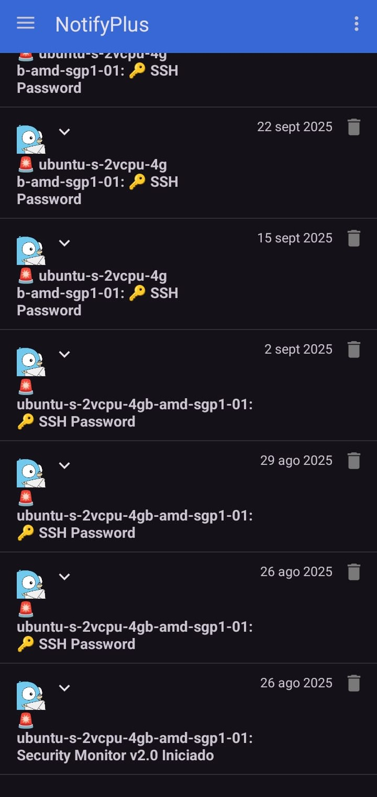

# Gotify Enhanced: HTML & Accordion Support 🚀


**Transform your notifications into interactive experiences!**

This is a supercharged version of the Gotify Android client, designed for power users who need more than just plain text. We've unlocked the full potential of your notifications with rich HTML support and interactive accordion layouts.

## ✨ New Features

<p align="center">
  
</p>

*   **Rich HTML Rendering**: Send notifications with full HTML support! Use tables, lists, bold, italic, and more to format your messages exactly how you want them.
*   **Interactive Accordions**: Keep your notification feed clean and organized. Use `<details>` and `<summary>` tags to create collapsible sections. Perfect for logs, stack traces, or long automated reports that you can expand with a tap! 
*   **Secure & Fast**: Optimized for performance and security, ensuring your data stays safe while looking great.

> [!WARNING]
> **Security Note**: JavaScript is enabled by default to support rich interactive content. If you plan to receive notifications from untrusted third-party sources, we strongly recommend disabling JavaScript in the source code (`settings.javaScriptEnabled = false` in `ListMessageAdapter.kt`) to prevent potential XSS attacks.

---

## Features (Original)

* show push notifications on new messages
* view and delete messages

## Installation

Download the apk or get the app via F-Droid or Google Play.

[][playstore]
[][fdroid]
[][release]

Google Play and the Google Play logo are trademarks of Google LLC.

### Disable battery optimization

By default Android kills long running apps as they drain the battery. With enabled battery optimization, Gotify will be killed and you wont receive any notifications.

Here is one way to disable battery optimization for Gotify.

* Open "Settings"
* Search for "Battery Optimization"
* Find "Gotify" and disable battery optimization

See also https://dontkillmyapp.com for phone manufacturer specific instructions to disable battery optimizations.

### Minimize the Gotify foreground notification

*Only possible for Android version >= 8*

The foreground notification showing the connection status can be manually minimized to be less intrusive:

* Open Settings -> Apps -> Gotify
* Click Notifications
* Click on `Gotify foreground notification`
* Toggle the "Minimize" option / Select a different "Behavior" or "Importance" (depends on your Android version)
* Restart Gotify

## Message Priorities

| Notification | Gotify Priority|
| - | - |
| - | 0 |
| Icon in notification bar | 1 - 3 |
| Icon in notification bar + Sound | 4 - 7 |
| Icon in notification bar + Sound + Vibration | 8 - 10 |

## Building

Use Java 17 and execute the following command to build the apk.

```bash
$ ./gradlew build
```

## Update client

* Run `./gradlew generateSwaggerCode`
* Delete `client/settings.gradle` (client is a gradle sub project and must not have a settings.gradle)
* Delete `repositories` block from `client/build.gradle`
* Delete `implementation "com.sun.xml.ws:jaxws-rt:x.x.x“` from `client/build.gradle`
* Insert missing bracket in `retryingIntercept` method of class `src/main/java/com/github/gotify/client/auth/OAuth`
* Commit changes

## Versioning
We use [SemVer](http://semver.org/) for versioning. For the versions available, see the
[tags on this repository](https://github.com/gotify/android/tags).

## License
This project is licensed under the MIT License - see the [LICENSE](LICENSE) file for details

---

## Credits & Original Project

This project is a fork of the awesome [Gotify Android](https://github.com/gotify/android) client. All credit for the core functionality goes to the original authors and contributors. We simply added some spicy HTML features on top! 🌶️

Gotify Android connects to [gotify/server](https://github.com/gotify/server) and shows push notifications on new messages.

 [github-action-badge]: https://github.com/gotify/android/workflows/Build/badge.svg
 [github-action]: https://github.com/gotify/android/actions?query=workflow%3ABuild
 [playstore]: https://play.google.com/store/apps/details?id=com.github.gotify
 [fdroid-badge]: https://img.shields.io/f-droid/v/com.github.gotify.svg
 [fdroid]: https://f-droid.org/de/packages/com.github.gotify/
 [fossa-badge]: https://app.fossa.io/api/projects/git%2Bgithub.com%2Fgotify%2Fandroid.svg?type=shield
 [fossa]: https://app.fossa.io/projects/git%2Bgithub.com%2Fgotify%2Fandroid
 [release-badge]: https://img.shields.io/github/release/gotify/android.svg
 [release]: https://github.com/gotify/android/releases/latest
